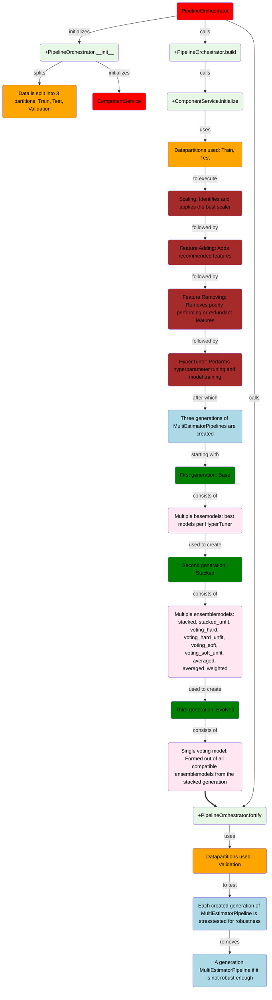

```mermaid
flowchart TD
    %% Services
    orchestrator(PipelineOrchestrator):::service
    orchestrator --> |initializes| orchestrator_init(+PipelineOrchestrator.__init__):::method
    orchestrator_init --> |splits| dataSplit(Data is split into 3 partitions: Train, Test, Validation):::dataset
    orchestrator_init --> |initializes| componentservice
    componentservice(ComponentService):::service

    %% Build Method
    orchestrator --> |calls| build(+PipelineOrchestrator.build):::method
    build --> |calls| initialize(+ComponentService.initialize):::method
    initialize --> |uses| TrainTestPartition(Datapartitions used: Train, Test):::dataset
    TrainTestPartition --> |to execute| scaling(Scaling: Identifies and applies the best scaler):::component
    scaling --> |followed by| feature_adding(Feature Adding: Adds recommended features):::component
    feature_adding --> |followed by| feature_removing(Feature Removing: Removes poorly performing or redundant features):::component
    feature_removing --> |followed by| hypertuner(HyperTuner: Performs hyperparameter tuning and model training):::component
    hypertuner --> |after which| generations(Three generations of MultiEstimatorPipelines are created):::process

    %% Pipeline Generations
    generations --> |starting with| pipeline_base(First generation: Base):::pipeline
    pipeline_base --> |consists of| models_base(Multiple basemodels: best models per HyperTuner):::model
    models_base --> |used to create| pipeline_stacked(Second generation: Stacked):::pipeline
    pipeline_stacked --> |consists of| models_stacked(Multiple ensemblemodels: stacked, stacked_unfit, voting_hard, voting_hard_unfit, voting_soft, voting_soft_unfit, averaged, averaged_weighted):::model
    models_stacked --> |used to create| pipeline_evolved(Third generation: Evolved):::pipeline
    pipeline_evolved --> |consists of| models_evolved(Single voting model: Formed out of all compatible ensemblemodels from the stacked generation):::model
    models_evolved ==> fortify

    %% Fortify Method
    orchestrator --> |calls| fortify(+PipelineOrchestrator.fortify):::method
    fortify --> |uses| validationPartition(Datapartitions used: Validation):::dataset
    validationPartition --> |to test| stressTest(Each created generation of MultiEstimatorPipeline is stresstested for robustness):::process
    stressTest --> |removes| removal(A generation MultiEstimatorPipeline if it is not robust enough):::process

    classDef service fill:red, color:black
    classDef method fill:#e6f7e6, color:black
    classDef component fill:brown, color:black
    classDef model fill:#ffe6f0, color:black
    classDef pipeline fill:green, color:black
    classDef process fill:lightblue, color:black
    classDef dataset fill:orange, color:black

```